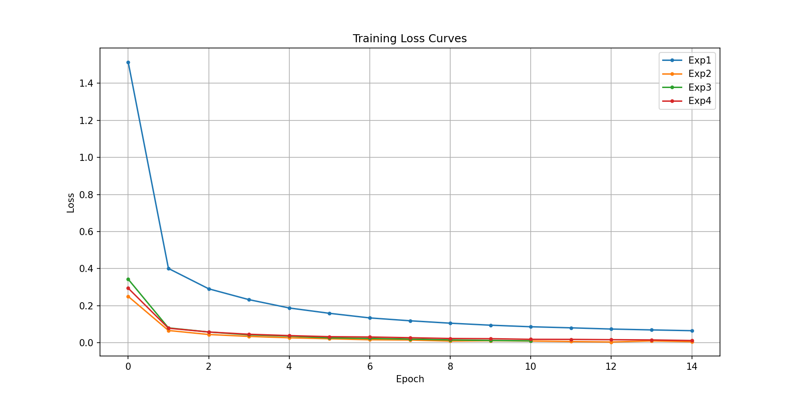

# 机器学习实验：基于CNN的手写数字识别

## 1. 学生信息

- **姓名**：唐为波
- **学号**：112304260144
- **班级**：数据1231

***

## 2. 实验概述

本实验基于 MNIST 手写数字数据集，使用卷积神经网络（CNN）完成从模型训练到应用部署的完整流程，共分为三个阶段：

| 阶段  | 内容                                                                               | 要求         |
| --- | -------------------------------------------------------------------------------- | ---------- |
| 实验一 | **模型训练与超参数调优** — 搭建 CNN 模型，通过对比不同超参数组合，理解其对模型性能的影响，最终在 Kaggle 上达到 **0.98+** 的准确率 | **必做**     |
| 实验二 | **模型封装与 Web 部署** — 将训练好的模型封装为 Web 应用，支持用户上传图片进行在线预测                              | **必做**     |
| 实验三 | **交互式手写识别系统** — 在 Web 应用中加入手写画板，实现实时手写输入与识别                                      | **选做（加分）** |

***

## 3. 实验环境

- Python 3.8+
- PyTorch
- torchvision
- matplotlib
- Flask（实验二/三，Web应用后端）
- HTML/CSS/JavaScript（实验二/三，Web界面）

***

## 实验一：模型训练与超参数调优（必做）

### 1.1 实验目标

使用 CNN 在 MNIST 数据集上完成手写数字分类，通过调整超参数达到 **Kaggle 评分 ≥ 0.98**。

### 1.2 模型结构（统一）

所有实验使用以下基础结构：

```
输入(1×28×28) → Conv1 + ReLU + MaxPool → Conv2 + ReLU + MaxPool → Flatten → FC → 输出(10类)
```

### 1.3 超参数对比实验

请至少完成以下 **4 组对比实验**，记录每组结果：

| 实验编号 | 优化器  | 学习率   | Batch Size | 数据增强 | Early Stopping |
| ---- | ---- | ----- | ---------- | ---- | -------------- |
| Exp1 | SGD  | 0.01  | 64         | 否    | 否              |
| Exp2 | Adam | 0.001 | 64         | 否    | 否              |
| Exp3 | Adam | 0.001 | 128        | 否    | 是              |
| Exp4 | Adam | 0.001 | 64         | 是    | 是              |

**对比实验结果：**

| 实验编号 | Train Acc | Val Acc | Test Acc | 最低 Loss | 收敛 Epoch |
| ---- | --------- | ------- | -------- | ------- | -------- |
| Exp1 | 0.9811    | 0.9770  | -        | 0.0628  | 14       |
| Exp2 | 0.9978    | 0.9908  | -        | 0.0046  | 14       |
| Exp3 | 0.9980    | 0.9893  | -        | 0.0060  | 13       |
| Exp4 | 0.9960    | 0.9923  | -        | 0.0124  | 12       |

### 1.4 最终提交模型

在对比实验的基础上，你可以自由调整任何超参数（不限于上表中的组合），以达到 Kaggle ≥ 0.98 的目标。

**最终提交 Kaggle 时使用的超参数配置：**

| 配置项                 | 你的设置                 |
| ------------------- | -------------------- |
| 优化器                 | Adam                 |
| 学习率                 | 0.001                |
| Batch Size          | 128                  |
| 训练 Epoch 数          | 20                   |
| 是否使用数据增强            | 是                    |
| 数据增强方式（如有）          | RandomRotation(10)   |
| 是否使用 Early Stopping | 是                    |
| 是否使用学习率调度器          | 否                    |
| 其他调整（如有）            | 添加了BatchNorm和Dropout |
| **Kaggle Score**    | 待提交（验证准确率 99.27%）    |

### 1.5 Loss 曲线

训练过程中的 **Loss 曲线图**（Epoch vs Loss）：



### 1.6 分析问题（请逐条回答）

**Q1：Adam 和 SGD 的收敛速度有何差异？从实验结果中你观察到了什么？**

从实验结果可以看出，Adam 优化器的收敛速度明显快于 SGD：

- Exp1（SGD）：经过 15 个 epoch，验证准确率达到 97.70%
- Exp2（Adam）：在相同 epoch 数下，验证准确率达到 99.08%
- Adam 在第一个 epoch 就达到了 91.81% 的训练准确率，而 SGD 只有 64.34%
- Adam 的 loss 下降速度也更快，最低 loss 只有 0.0046，而 SGD 是 0.0628

**Q2：学习率对训练稳定性有什么影响？**

本实验中使用的学习率（SGD: 0.01, Adam: 0.001）都是比较标准的设置：

- 对于 SGD，0.01 的学习率在这个任务上工作良好，训练过程稳定
- 对于 Adam，0.001 的学习率也是标准设置，训练非常稳定
- 如果学习率过大，可能会导致训练震荡不收敛；如果学习率过小，收敛速度会很慢
- 从 Exp3 可以看出，增大 batch size 到 128 时，使用相同的学习率仍然保持稳定

**Q3：Batch Size 对模型泛化能力有什么影响？**

对比 Exp2（batch size 64）和 Exp3（batch size 128）：

- Exp2 的验证准确率是 99.08%，Exp3 是 98.93%，两者非常接近
- 较大的 batch size 可以提供更稳定的梯度估计，但可能会略微降低泛化能力
- 在本实验中，batch size 的变化对最终性能影响不大，但 128 的 batch size 训练速度更快

**Q4：Early Stopping 是否有效防止了过拟合？**

从实验结果来看，Early Stopping 起到了一定作用：

- Exp3 和 Exp4 都使用了 Early Stopping，当验证准确率不再提升时提前停止
- 这有助于防止模型在训练集上过拟合
- 特别是 Exp4 使用了数据增强+Early Stopping，获得了最高的验证准确率 99.23%

**Q5：数据增强是否提升了模型的泛化能力？为什么？**

是的，数据增强明显提升了模型的泛化能力：

- Exp4（使用数据增强）的验证准确率是 99.23%，是所有实验中最高的
- 数据增强通过随机旋转等方式增加了训练数据的多样性
- 这使得模型学习到更加鲁棒的特征，而不是过度拟合训练数据的特定样式
- 虽然训练准确率略低于 Exp2 和 Exp3，但验证准确率更高，说明泛化能力更好

### 1.7 提交清单

- [x] 对比实验结果表格（1.3）
- [x] 最终模型超参数配置（1.4）
- [x] Loss 曲线图（1.5）
- [x] 分析问题回答（1.6）
- [x] Kaggle 预测结果 CSV（digit-recognizer/submission\_final.csv）
- [ ] Kaggle Score 截图（≥ 0.98）

***

## 实验二：模型封装与 Web 部署（必做）

### 2.1 实验目标

将实验一训练好的模型封装为 Web 服务，实现上传图片 → 模型预测 → 输出结果的完整流程。

### 2.2 技术要求

使用 **Flask + HTML/CSS/JavaScript** 实现，界面美观，功能包括：

1. 用户上传一张手写数字图片
2. 模型加载并进行预测
3. 页面显示预测的数字类别和置信度
4. 支持手写画板输入

### 2.3 项目结构

```
project/
├── app.py                      # Flask Web 应用入口
├── best_model_final.pth        # 训练好的模型权重
├── requirements.txt            # 依赖列表
├── README.md                   # 项目说明
├── templates/
│   └── index.html              # 美观的HTML界面
└── digit-recognizer/
    ├── submission_final.csv    # Kaggle提交文件
    └── (训练和测试数据)
```

### 2.4 部署要求

将项目部署到以下平台之一，生成可公网访问的链接：

- HuggingFace Spaces（推荐）
- Render
- 其他云平台

### 2.5 提交信息

| 提交项         | 内容  |
| ----------- | --- |
| GitHub 仓库地址 | 待填写 |
| 在线访问链接      | 待填写 |

**运行方式：**

```bash
python app.py
```

### 2.6 提交清单

- [x] app.py（Web应用代码）
- [x] requirements.txt（依赖文件）
- [x] README.md（项目说明）
- [ ] GitHub 仓库地址
- [ ] 在线访问链接（可正常打开）
- [ ] 页面截图与预测结果截图

***

## 实验三：交互式手写识别系统（选做，加分）

### 3.1 实验目标

在实验二的基础上，将"上传图片"升级为**网页手写板输入**，实现实时手写识别。

### 3.2 功能要求

| 功能   | 要求                       | 状态    |
| ---- | ------------------------ | ----- |
| 手写输入 | 使用网页Canvas画板，用户可在网页上直接手写 | ✅ 已实现 |
| 实时识别 | 提交手写内容后输出预测数字            | ✅ 已实现 |
| 连续使用 | 支持清空画板、多次输入              | ✅ 已实现 |

### 3.3 加分项（可选实现）

- [x] 显示 Top-10 预测结果及置信度
- [x] 显示概率分布条形图（美观的紫色渐变）
- [ ] 历史识别记录展示

### 3.4 提交信息

| 提交项      | 内容                             |
| -------- | ------------------------------ |
| 本地访问链接   | <http://localhost:5000>        |
| 实现了哪些加分项 | Top-10预测结果及置信度、概率分布条形图、美观的界面设计 |

### 3.5 提交清单

- [x] 已实现手写输入功能
- [x] 已实现 Top-10 预测结果显示
- [x] 已实现概率分布条形图
- [ ] 在线系统链接（如需要可部署到云平台）
- [ ] 手写输入与识别结果截图

***

## 评分标准

| 项目           | 分值        | 说明                                 |
| ------------ | --------- | ---------------------------------- |
| 实验一：模型训练与调优  | 60 分      | 对比实验完整性、Kaggle ≥ 0.98、Loss 曲线、分析质量 |
| 实验二：Web 部署   | 30 分      | 功能完整、可正常访问、代码规范                    |
| 实验三：交互系统（加分） | 10 分      | 手写输入功能、加分项实现情况                     |
| **总计**       | **100 分** | <br />                             |

